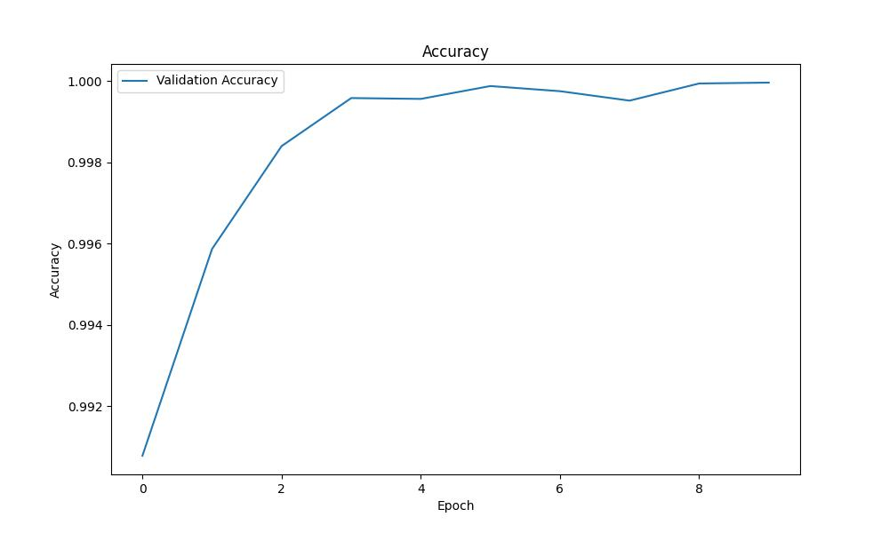
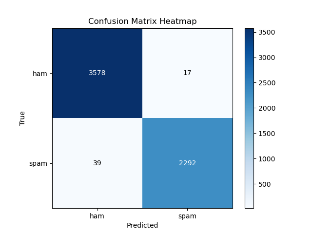

# RoBERTa based Smishing Message Detection
Spam messages often contain harmful links or phishing attempts, which pose significant dangers to organizations and their users. Opting for our RoBERTa-powered spam detection system allows organizations to bolster their security measures significantly. Our system efficiently identifies and removes spam messages, providing an additional level of protection that helps shield organizations from potential financial losses, legal issues, and damage to their reputation.

## Dataset
The dataset is composed of messages labeled by ham or spam, merged from three data sources:
1.	SMS Spam Collection https://www.kaggle.com/datasets/uciml/sms-spam-collection-dataset
2.	Telegram Spam Ham https://huggingface.co/datasets/thehamkercat/telegram-spam-ham/tree/main
3.	Enron Spam:  https://huggingface.co/datasets/SetFit/enron_spam/tree/main (only used message column and labels)

The prepare script for enron is available at https://github.com/mshenoda/roberta-spam/tree/main/data/enron.
The data is split 80% train 10% validation, and 10% test sets; the scripts used to split and merge of the three data sources are available at: https://github.com/mshenoda/roberta-spam/tree/main/data/utils.

### Dataset Class Distribution

Training  80%  |  Validation  10%   |  Testing  10%          
:-------------------------:|:-------------------------:|:-------------------------: 
 Class Distribution |  Class Distribution |   Class Distribution


## Model Architecture
The model is fine tuned RoBERTa base 

roberta-base: https://huggingface.co/roberta-base

paper: https://arxiv.org/abs/1907.11692 


## Metrics
Loss    |  Accuracy      |  Precision / Recall     |    Confusion Matrix          
:-------------------------:|:-------------------------:|:-------------------------:|:-------------------------: 
 Train / Validation |  Validation |   Validation |   Testing Set

## Required Packages
- numpy
- torch
- transformers
- pandas
- tqdm
- matplotlib


### Install
```
pip3 install -r requirements.txt
```

## Directory Structure
Place all the files in same directory as the following:
```
├─── data/          contains csv data files
├─── plots/         contains metrics results and plots   
├─── roberta-spam   trained model weights 
├─── utils/         contains helper functions
├─── demo.ipynb     jupyter notebook run the demo 
├─── detector.py    SpamMessageDetector with methods train, evaluate, detect 
└─── dataset.py     custom dataset class for spam messages
```

## Running Demo
To run the demo, please run the following Jupyter Notebook: demo.ipynb